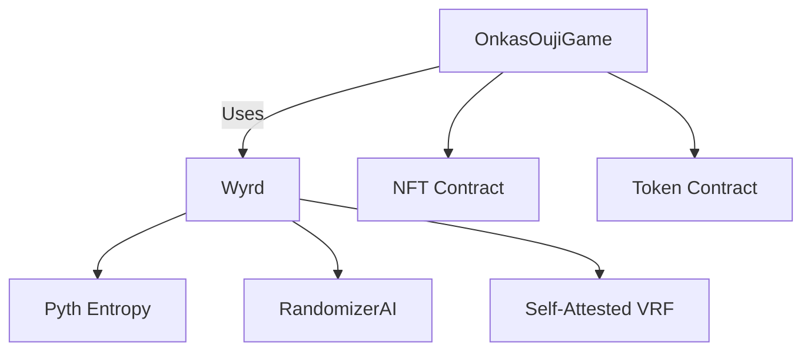

# Onkas Ouji - Smart Contracts

<!-- TODO: banner? -->

<!-- TODO: add details etc -->

This repository contains contract source code for the Onkas Ouji game.

## Overview

The Onkas Ouji game is an on-chain battle game where players pit their NFT characters against each other in dice-based combat. This repository contains the core smart contracts powering the game's mechanics, including:

- Game logic and battle resolution
- Randomness generation (using multiple sources)
- Betting and payout systems
- NFT integration

## Key Contracts

### `OnkasOujiGame.sol`
The main game contract handling:
- Game creation and management
- Player vs player battles
- Betting mechanics
- Payout calculations

### `Wyrd.sol`
The randomness provider contract featuring:
- Multi-source randomness aggregation (Pyth Entropy, RandomizerAI, Self-Attested VRF)
- Fault-tolerant design
- Cryptographic security guarantees

## Technical Stack

- **Solidity** v0.8.26
- **Foundry** for development and testing
- **Solady** for optimized utility functions
- **Pyth Entropy** for verifiable randomness
- **RandomizerAI** for additional randomness source

## Getting Started

### Prerequisites
- Foundry (https://getfoundry.sh)
- Node.js (for optional tooling)
- Access to Ethereum RPC endpoint

### Installation
```bash
git clone
cd <repository_name>
forge install
```

### Build Contracts
```bash
make
```

### Testing
Run the comprehensive test suite:
```bash
make test
```

## Deployment

### Testnet Deployment
```bash
forge script script/Deploy.s.sol:DeployScript \
    --rpc-url ${TESTNET_RPC_URL} \
    --broadcast \
    -vvvv
```

### Mainnet Deployment
```bash
forge script script/Deploy.s.sol:DeployScript \
    --rpc-url ${MAINNET_RPC_URL} \
    --broadcast \
    -vvvv
```

## Key Features

### Game Mechanics
- 5-round battles with best-of-3 wins
- Dice-based combat resolution
- NFT character statistics tracking
- Player vs player wagering

### Randomness System
- Multi-source aggregation for security
- Configurable randomness providers
- Cryptographic guarantees
- Fault tolerance

### Security
- Reentrancy protection
- Input validation
- Role-based access control
- Comprehensive error handling

## Architecture



## Development Workflow

1. Make changes to contracts
2. Run tests: `forge test`
3. Check gas usage: `forge snapshot`
4. Format code: `forge fmt`
5. Deploy to testnet for verification

## Contributing

Contributions are welcome! Please:
1. Fork the repository
2. Create a feature branch
3. Submit a pull request

## License

AGPL-3.0-only

## Disclaimer

These contracts are unaudited. Use at your own risk. The developers assume no liability for any losses incurred while interacting with these smart contracts.
